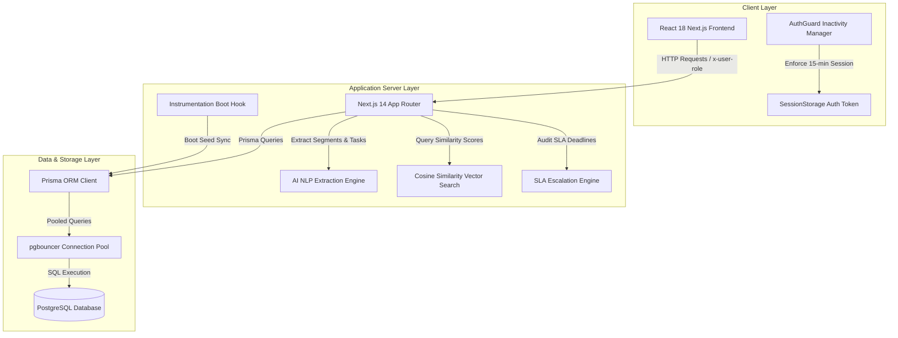

# MeetIQ Ops Console — Architecture Overview

Architectural documentation detailing the system topology, component interactions, data lifecycles, and security model of MeetIQ Ops Console.

---

## 🏗️ System Architecture Diagram

---

## 🔄 End-to-End Data Lifecycle

### 1. Meeting Ingestion & AI Extraction Phase
1. User submits meeting transcript via `POST /api/meetings`.
2. `ai-engine.ts` parses transcript lines using regex rules and NLP categorizers.
3. Formats diarized speech segments (`discussion`, `decision`, `action_item`).
4. Persists `Meeting`, `MeetingSegment`, `Decision`, and `Task` entities atomically via Prisma transaction.

### 2. Task SLA Escalation Lifecycle
1. Task created with `status = "Pending"`, `escalationLevel = 0`, and calculated `deadline`.
2. `cron/escalate` or top nav `Audit SLA` triggers `escalation-engine.ts`.
3. If `now > deadline` and `escalationLevel == 0`:
   - Task `status` updated to `"Overdue"`.
   - `escalationLevel` set to `1`.
   - Warning `Notification` generated for task owner.
4. If `hoursOverdue >= 24` and `escalationLevel <= 1`:
   - Task `status` updated to `"Escalated"`.
   - `escalationLevel` set to `2`.
   - Manager `Notification` generated and targeted to Department Lead.

### 3. Semantic Search Vector Processing
1. User enters natural language query in `/knowledge`.
2. `vector-search.ts` computes query term embeddings or TF-IDF frequency vectors.
3. Iterates over `Decision` and `MeetingSegment` records stored in PostgreSQL.
4. Computes cosine similarity vector angle:
   $$\text{Similarity}(\vec{A}, \vec{B}) = \frac{\vec{A} \cdot \vec{B}}{\|\vec{A}\| \|\vec{B}\|}$$
5. Ranks and returns top results with confidence scores.

---

## 🔒 Security Architecture

- **Password Hashing**: Client-side Web Crypto SHA-256 hashing converts plain passwords into 64-character hexadecimal digests prior to session authentication.
- **Session Persistence**: Authentication state (`userRole`, `username`, `lastActivity`) stored strictly in client `sessionStorage` (preventing persistent disk token leaks).
- **Inactivity Session Guard**: `AuthGuard.tsx` listens to mouse, click, and keypress events. Automatically purges `sessionStorage` and redirects to `/login` if idle for >15 minutes.
- **Role-Based Access Control (RBAC)**: Destructive and administrative endpoints inspect the custom `x-user-role` HTTP header:
  - Requests containing `x-user-role: participant` calling `DELETE /api/meetings/:id` or `PATCH /api/tasks/:id/assign` are rejected with `403 Forbidden`.
