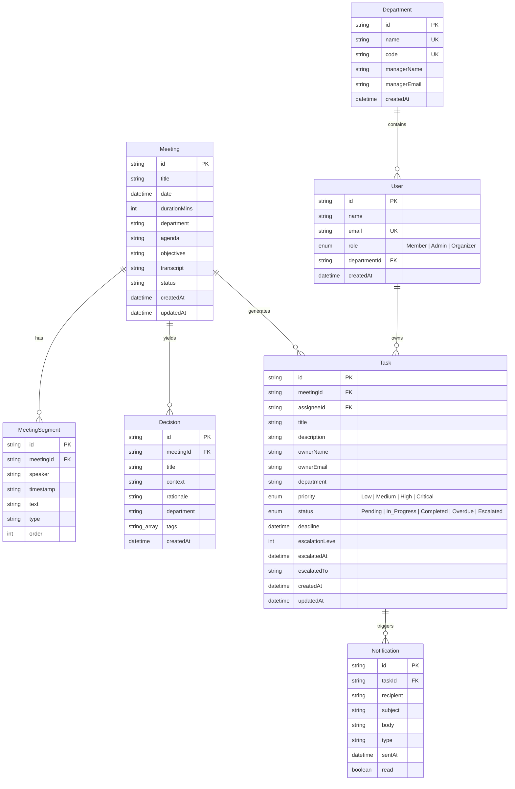

# Innovexa Ops Console — Database & Prisma Architecture

Comprehensive documentation of the PostgreSQL database schema, Prisma ORM configuration, performance indexes, and migration procedures.

---

## 📊 Entity Relationship (ER) Diagram



---

## ⚡ PostgreSQL Native Features

### 1. Native Enums
Strictly enforced database-level type safety for permissions and lifecycle states:
- `Role`: `'Member'`, `'Admin'`, `'Organizer'`
- `TaskStatus`: `'Pending'`, `'In_Progress'`, `'Completed'`, `'Overdue'`, `'Escalated'`
- `TaskPriority`: `'Low'`, `'Medium'`, `'High'`, `'Critical'`

### 2. Native Array Types (`String[]`)
The `Decision` model utilizes native PostgreSQL array columns (`tags String[] @default([])`), eliminating stringified JSON parsing overhead during semantic searches.

### 3. B-Tree Performance Indexing
High-performance B-Tree indexes configured on critical query fields:
- `Meeting`: `@@index([date])`, `@@index([department])`
- `Task`: `@@index([status])`, `@@index([department])`, `@@index([deadline])`, `@@index([meetingId])`

---

## 🔄 Migration & Connection Workflow

### Connection String Separation
- **`DATABASE_URL`**: Pooled connection string (`?pgbouncer=true&sslmode=require`) used by serverless runtime instances.
- **`DIRECT_URL`**: Direct connection string used by Prisma CLI during schema migrations (`npx prisma migrate dev`).

### Migration Commands
```bash
# Generate Prisma Client after schema changes
npx prisma generate

# Create and apply a new migration (Development)
npx prisma migrate dev --name add_custom_index

# Deploy pending migrations (Production)
npx prisma migrate deploy
```

---

## 🔍 Query Profiling & Optimization

Use `EXPLAIN ANALYZE` to verify index scanning:

```sql
-- Benchmark Task status lookup
EXPLAIN ANALYZE SELECT * FROM "Task" WHERE status = 'Overdue' AND department = 'Engineering';
```

---

## 💾 Backup & Restore Procedures

### Database Dump (Backup)
```bash
pg_dump -U postgres -d innovexa_db -F c -b -v -f innovexa_backup.dump
```

### Database Restore
```bash
pg_restore -U postgres -d innovexa_db -v innovexa_backup.dump
```

