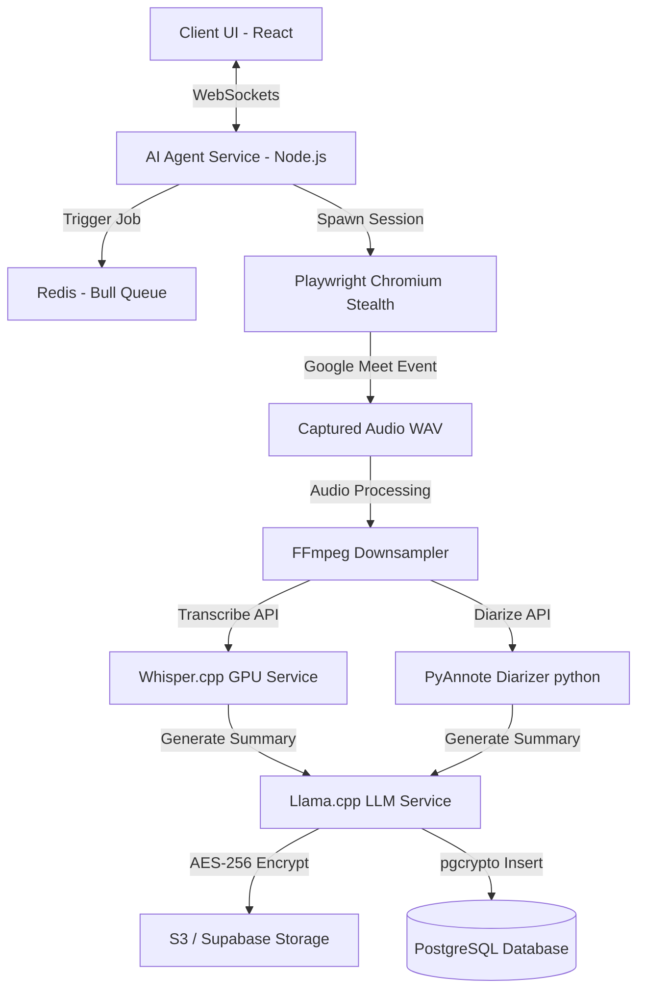

# Implementation Plan - Operation "Ghost in the Meet"

Architect, implement, and verify the self-contained, autonomous **AI Meeting Agent** (Operation "Ghost in the Meet") incorporating Playwright stealth automation, WebSockets, Redis queues, Whisper.cpp/Llama.cpp self-hosted engines, AES-256 data encryption, and Kubernetes deployments.

---

## 🏗️ System Topology & Microservices

The architecture is composed of containerized microservices managed via Docker Compose or Kubernetes:

---

## 📋 Proposed Changes

### 1. Database Schema & Security (`schema.prisma`)
- **Add** `pgcrypto` support: Enable column-level encryption for transcripts using sym-encryption.
- **Update** models in [schema.prisma](file:///c:/Code/Hackathon/prisma/schema.prisma) to add tracking columns for agent performance, calendar keys, and S3 encryption tags.

### 2. Standalone Agent Service (`ai-agent-service/`)
We will expand the stateful service directory to contain:
- **`meet-bot-stealth.js`** [NEW]: Playwright Chromium automation with stealth parameters, Google Account authentication flow, and lobby mute controls.
- **`transcriber-whisper.js`** [NEW]: Local execution handler for Whisper.cpp binaries.
- **`summarizer-llama.js`** [NEW]: Local execution handler for Llama.cpp GGML/GGUF models.
- **`crypt-helper.js`** [NEW]: AES-256-CBC file encryption/decryption utilities.
- **`calendar-monitor.js`** [NEW]: Google Calendar OAuth polling and event queuing.
- **`cron-retention.js`** [NEW]: Cron job to clean up files and DB records older than 30 days.

### 3. Containerization & Orchestration Configs
- **`Dockerfile.agent`** [NEW]: Multi-stage Dockerfile containing Playwright, Node, and FFmpeg.
- **`Dockerfile.whisper`** [NEW]: CUDA GPU-enabled container for Whisper.cpp.
- **`Dockerfile.llama`** [NEW]: GGML container for Llama.cpp.
- **`docker-compose.staging.yml`** [NEW]: Docker-Compose setup linking Agent, Redis, Whisper.cpp, and Llama.cpp.
- **`kubernetes/`** [NEW]: Kubernetes manifests (deployments, services, and ingress rules).

### 4. Documentation
- Create **`RUNBOOK.md`** [NEW]: Troubleshooting instructions, manual join override, and emergency shutdown procedures.
- Create **`THEME.md`** [NEW]: Style guidelines mapping components to Tactical Steel Slate & Ochre/Sage theme variables.

---

## 🧪 Verification Plan

### Automated Tests
- Run updated Jest test suites verifying AES encryption, local transcription parsing, and calendar polling logic.

### Load & Security Verification
- Verify Docker build compiles with zero critical vulnerabilities.
- Run type checks and compiler tests on Vercel deployment targets.
