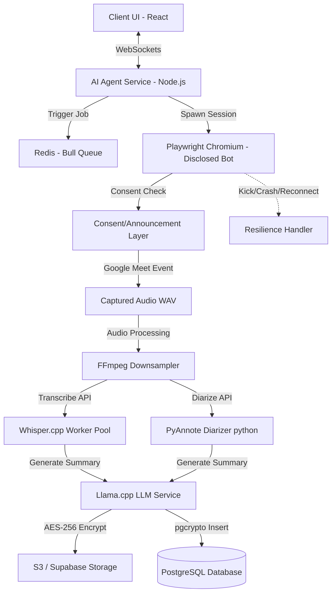

# Implementation Plan v2 - Innovexa AI Meeting Agent

Architect, implement, and verify a self-contained, disclosed **AI Meeting Agent** incorporating Playwright automation, WebSockets, Redis queues, Whisper.cpp/Llama.cpp self-hosted engines, AES-256 data encryption, and Kubernetes deployments.

> **Naming note:** Renamed from "Ghost in the Meet" / "stealth automation." The bot must be a visibly disclosed participant, not a covert one — this shapes both legal posture and engineering goals (compliant behavior vs. detection evasion).

---

## 🏗️ System Topology & Microservices

---

## 📋 Proposed Changes

### 1. Database Schema & Security (`schema.prisma`)
- **Add** `pgcrypto` support: column-level encryption for transcripts using sym-encryption.
- **Add** tracking columns for agent performance, calendar keys, and S3 encryption tags.
- **Add** `retention_policy` table: per-workspace/per-user configurable retention window (default 30 days, overridable), plus `consent_status` and `consent_log` fields per meeting.

### 2. Standalone Agent Service (`ai-agent-service/`)

| File | Purpose |
|---|---|
| `meet-bot.js` **[NEW]** | Playwright Chromium automation with visible bot identity (labeled name/avatar), Google Account auth flow, lobby handling |
| `consent-announcer.js` **[NEW]** | Posts an in-meeting chat message / on-screen indicator when recording starts; supports host-configurable opt-out |
| `transcriber-whisper.js` **[NEW]** | Local execution handler for Whisper.cpp binaries, dispatched via worker pool |
| `summarizer-llama.js` **[NEW]** | Local execution handler for Llama.cpp GGML/GGUF models |
| `crypt-helper.js` **[NEW]** | AES-256-CBC file encryption/decryption utilities |
| `calendar-monitor.js` **[NEW]** | Google Calendar OAuth polling and event queuing, scoped to the requesting user's own calendar/org permissions |
| `cron-retention.js` **[NEW]** | Cleans up files/DB records per the configurable `retention_policy`, not a hardcoded 30 days |
| `resilience-handler.js` **[NEW]** | Detects bot removal/kick, lobby timeout, or Playwright session crash; handles reconnect attempts and flushes partial audio before failing |
| `auth-gateway.js` **[NEW]** | Validates that a Client UI request to join a meeting is authorized against the calendar event owner/invitee list — prevents cross-user join triggering |

### 3. Consent & Disclosure Layer *(new section)*
- Bot joins with a clearly labeled name (e.g. "Innovexa Notetaker") and avatar — never blank/anonymous.
- On join, posts an announcement in meeting chat and/or triggers a visible on-screen banner where the platform supports it.
- Meeting organizer can require explicit participant opt-in before recording begins (configurable per workspace, since consent law varies by jurisdiction — some are one-party, some two-party/all-party consent).
- If a participant objects, the bot supports a "leave/stop recording" command.
- All consent events are logged (`consent_log`) alongside the transcript for audit purposes.

### 4. Containerization & Orchestration Configs
- **`Dockerfile.agent`** [NEW]: Multi-stage Dockerfile with Playwright, Node, and FFmpeg.
- **`Dockerfile.whisper`** [NEW]: CUDA GPU-enabled container for Whisper.cpp.
- **`Dockerfile.llama`** [NEW]: GGML container for Llama.cpp.
- **`docker-compose.staging.yml`** [NEW]: Compose setup linking Agent, Redis, Whisper.cpp, and Llama.cpp.
- **`kubernetes/`** [NEW]: Manifests for deployments, services, ingress, and **HPA (Horizontal Pod Autoscaler)** for the Whisper/Llama worker pools, so GPU containers scale with queue depth instead of running one-per-session.

### 5. Documentation
- **`RUNBOOK.md`** [NEW]: Troubleshooting, manual join override, emergency shutdown, and kick/crash recovery procedures.
- **`THEME.md`** [NEW]: Style guidelines mapping components to Tactical Steel Slate & Ochre/Sage theme variables.
- **`CONSENT_POLICY.md`** [NEW]: Jurisdiction-aware guidance for workspace admins on configuring consent requirements.

---

## 🧪 Verification Plan

### Automated Tests
- Jest suites verifying AES encryption, local transcription parsing, and calendar polling logic.
- New: tests for `auth-gateway.js` cross-user join prevention.
- New: tests for `resilience-handler.js` — simulate kick, crash, and lobby timeout scenarios.
- New: tests for `consent-announcer.js` — verify announcement fires before audio capture begins, and opt-out halts recording.

### Bot-Join Flow Testing *(new)*
- Since Meet's DOM and bot-detection heuristics change over time, run scheduled integration tests (not just at build time) against a real/staging Meet instance to catch breakage early.
- Test across meeting sizes (2, 10, 50+ participants) and degraded network conditions for audio capture quality.

### Load & Security Verification
- Verify Docker build compiles with zero critical vulnerabilities.
- Run type checks and compiler tests on deployment targets.
- Load-test the Whisper/Llama worker pool under concurrent meeting sessions to validate autoscaling and cost bounds (GPU time is the main cost driver — this needs a number before launch, not after).

### Compliance Review *(new)*
- Legal/compliance sign-off on default consent behavior per target region before enabling by default in any jurisdiction with all-party consent requirements.
